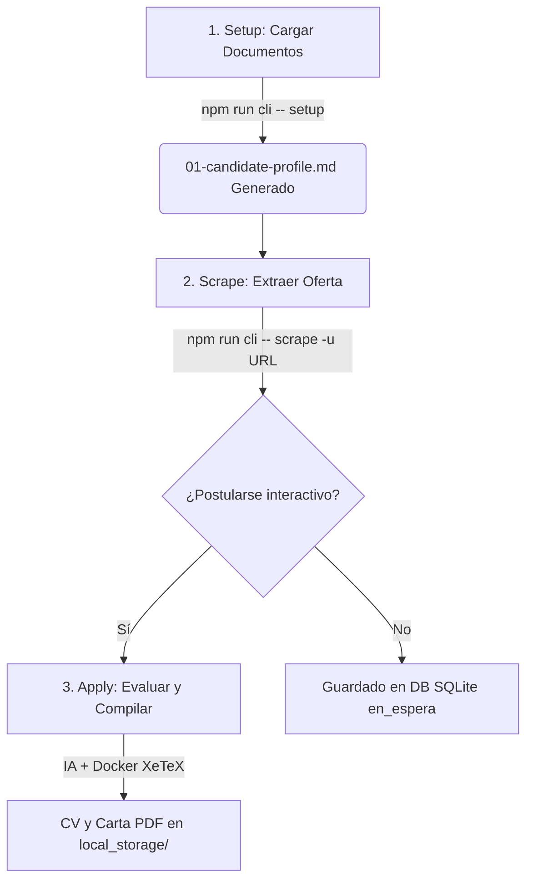

# AI Job Search CLI (NestJS + Gemini)

Esta es una herramienta de línea de comandos (CLI) moderna, interactiva y extensible construida con **NestJS**, **nest-commander**, la **API de Google Gemini** y **Docker** para automatizar, evaluar y optimizar tu postulación a ofertas de empleo de forma local y soberana.

> [!NOTE]
> Este proyecto es un **fork y reescritura completa** adaptada a la API de **Google Gemini** y estructurada con **NestJS** a partir del repositorio original basado en Claude de [Mads Lorentzen (ai-job-search)](https://github.com/MadsLorentzen/ai-job-search).

---

## 🚀 Flujo de Trabajo Recomendado

El ciclo de postulación completo se realiza en 3 pasos sencillos desde tu terminal:



---

## 🛠️ Características Principales

1. **Automatización del Perfil de Candidato (`setup`)**:
   * Escanea tus carpetas locales de CVs, diplomas, LinkedIn y referencias.
   * Extrae texto plano de archivos `.txt`, `.md` y `.pdf` (usando `pdf-parse`).
   * Gemini analiza y estructura tu perfil consolidado en `docs_prompts/skills/job-application-assistant/01-candidate-profile.md`.

2. **Scraping Inteligente y Evasión de Bloqueos (`scrape`)**:
   * Navegación automatizada con **Playwright** y evasión anti-bot integrada con **Stealth**.
   * Estrategias de parseo específicas para portales principales.
   * Detección de hashes y paneles laterales en listados de búsqueda.

3. **Evaluación de Ajuste y Adaptación de Documentos (`apply`)**:
   * Lectura automática de tu perfil Markdown unificado.
   * Evaluación de fit técnico por Gemini (retorna score JSON estructurado).
   * Generación y adaptación de código LaTeX para tu Currículum y Carta de Presentación.
   * Post-procesador de XeTeX para escapar ampersands (`&`) y corregir dependencias (`hyperref`).

4. **Compilación PDF Aislada**:
   * Compilación a través de contenedores **Docker** temporales.
   * Auto-limpieza de archivos auxiliares (`.aux`, `.log`, `.out`).

5. **Persistencia Local**:
   * Base de datos SQLite (`job_search.sqlite`) gestionada por TypeORM.
   * Trazabilidad completa de vacantes, postulaciones y evaluaciones con borrado relacional en cascada (`onDelete: 'CASCADE'`).

---

## 📋 Requisitos Previos

* **Node.js** (v20 o superior recomendado, verificado con v22).
* **Docker Desktop** (para compilar LaTeX a PDF de forma aislada).
* Una clave de API de Gemini (`GEMINI_API_KEY`).

---

## ⚙️ Configuración Inicial

1. **Clonar e Instalar Dependencias**:
   ```bash
   git clone <repo-url>
   cd ai-job-search
   npm install
   ```

2. **Descargar los ejecutables de Playwright**:
   ```bash
   npx playwright install chromium
   ```

3. **Configurar las Variables de Entorno**:
   Crea un archivo `.env` en la raíz del proyecto:
   ```env
   GEMINI_API_KEY=tu_api_key_de_gemini
   ```

4. **Preparar tus Documentos**:
   Coloca tus documentos iniciales en formato `.pdf`, `.txt` o `.md` dentro de la carpeta `documents/` (ej. `documents/cv/MiCV.pdf`, `documents/linkedin/perfil.pdf`, etc.).

---

## 💻 Comandos de la CLI

### 1. Inicializar Perfil de Candidato
Analiza los archivos colocados en `documents/` y genera tu perfil consolidado:
```bash
npm run cli -- setup
```

### 2. Raspar Vacante por URL
Extrae los datos de la vacante, los guarda en la DB SQLite local en estado `EN_ESPERA` y te pregunta interactivamente si deseas generar los PDFs en ese instante:
```bash
npm run cli -- scrape -u "https://mx.computrabajo.com/trabajo-de-desarrollador-node-js"
```

### 3. Postulación Directa (Manual)
Si no deseas hacer scraping de la URL, puedes ingresar la vacante de forma manual pasándole flags para control de idioma y país de trazabilidad:
```bash
npm run cli -- apply -c "AeroTech" -r "Senior NestJS Engineer" -d "Buscamos un desarrollador backend experto en Node.js, NestJS y Docker..." -l "Español" -ct "México"
```
* **Flags disponibles**:
  * `-l, --language [language]`: Idioma para los documentos (por defecto "Español").
  * `-ct, --country [country]`: Ubicación de la vacante (por defecto "No especificado").

### 4. Listar Historial de Postulaciones
Visualiza el historial completo de tus postulaciones directamente en tu terminal como una tabla organizada por fecha de postulación descendente:
```bash
npm run cli -- list
```
* Muestra información de: ID, Empresa, Puesto, Modalidad, Estado de Postulación, Puntuación de Ajuste (Score) de IA y Fecha de postulación.

### 5. Actualizar Estado de Postulación
Modifica el estado de una postulación registrada en tu base de datos SQLite por su ID:
```bash
npm run cli -- status -i <id_postulacion> -s <nuevo_estado>
```
* **Flags obligatorios**:
  * `-i, --id <id>`: ID numérico de la postulación.
  * `-s, --status <status>`: Nuevo estado a asignar (`EN_ESPERA`, `ENVIADO`, `ENTREVISTA`, `RECHAZADO`). El comando normaliza automáticamente a mayúsculas.

### 6. Preparación y Simulacro de Entrevista
Genera una guía de preparación estructurada ("Prep Pack") y ejecuta una simulación interactiva de entrevista técnica/comportamental en la terminal basada en la vacante y tus documentos reales:
```bash
npm run cli -- interview -i <id_postulacion>
```
* **Flags obligatorios**:
  * `-i, --id <id>`: ID numérico de la postulación.
* **Flujo**:
  1. Te solicita el nombre de la etapa y el entrevistador de forma interactiva.
  2. Lee el código fuente del CV y Carta de Presentación guardados en el almacenamiento de la vacante.
  3. Genera y guarda una guía de estudio personalizada en Markdown (`interview_prep_{etapa}.md`).
  4. Inicia un chat en la terminal con Gemini actuando como reclutador/entrevistador, haciendo preguntas y repreguntas técnicas y de comportamiento. Escribe `salir` para terminar la sesión.

### 7. Pruebas del Entorno
Ejecuta diagnósticos rápidos del estado de la API, Docker y base de datos:
```bash
npm run cli -- test
```

---

## 🌐 Portales de Trabajo Soportados

El CLI cuenta con lógicas de evasión y selectores optimizados para los siguientes portales de empleo:

* **LinkedIn (`linkedin.com`)**:
  * *Normalización inteligente*: Si le pasas la URL de una alerta o búsqueda (`/jobs/search/?currentJobId=XXX`), la CLI extraerá el ID de la vacante y redirigirá internamente a la página directa limpia (`/jobs/view/XXX/`) evitando redirecciones y muros de autenticación.
* **CompuTrabajo (`computrabajo.com`)**:
  * *Estrategia de paneles*: Soporte para URLs con Hash (`#`). Detecta si se despliega un panel lateral `.box_detail` y extrae los datos acotados a dicho panel sin interferir con la página de búsqueda general.
* **OCC Mundial (`occ.com.mx`)**
* **Simply Hired (`simplyhired.mx` o `.com`)**
* **freehire.dev (`freehire.dev`)**:
  * *Estructura limpia*: Soporta extracción rápida del título principal (`h1`), enlace al perfil de la compañía (`a[href*="/companies/"]`) y la descripción del puesto (`.job-description`).

---

## 🔌 Cómo Agregar Soporte a Nuevos Portales

El sistema utiliza un **patrón Strategy simple** dentro del servicio del Scraper. Para dar soporte a un nuevo portal de empleo (por ejemplo, `indeed.com`):

1. Abre el archivo [scraper.service.ts](src\scraper\scraper.service.ts).
2. Agrega un bloque condicional en el método `extractVacancyData` comprobando el dominio:
   ```typescript
   } else if (hostname.includes('indeed.com')) {
     this.logger.log('Procesando portal Indeed...');
     // Esperar a que cargue el elemento principal
     await page.waitForSelector('.jobsearch-JobComponent', { timeout: 15000 }).catch(() => {});
     
     // Extraer los textos usando getTextContent con las clases CSS del portal
     title = await this.getTextContent(page, 'h1.jobsearch-JobInfoHeader-title');
     company = await this.getTextContent(page, '.jobsearch-CompanyInfoWithoutHeaderImage');
     description = await this.getTextContent(page, '#jobDescriptionText');
   }
   ```
3. El servicio procesará automáticamente el texto extraído, detectará la modalidad (Remoto/Presencial/Híbrido) y lo insertará de forma normalizada en la base de datos local.

---

## 🧑‍💻 Créditos y Licencia

Este proyecto ha sido desarrollado sobre la base conceptual de **ai-job-search** de **Mads Lorentzen**, licenciada bajo la licencia MIT. Agradecemos su contribución a la comunidad de código abierto por sentar las bases de la automatización inteligente en la búsqueda de empleo.

* **Creador original**: [Mads Lorentzen (Github)](https://github.com/MadsLorentzen)
* **Repositorio original**: [MadsLorentzen/ai-job-search](https://github.com/MadsLorentzen/ai-job-search)
